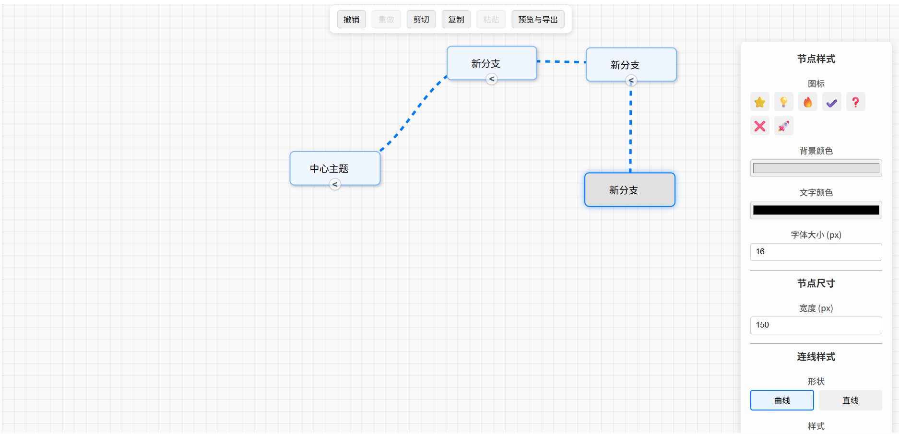

# MindMapReact

一个功能还算完善的React实现的思维导图，提供较为丰富的交互功能和自定义选项。

## 功能特性

- 🌌 **无限画布** - 无边界缩放和拖拽的画布空间
- ↪️ **撤销重做** - 完整的历史操作记录，支持撤销和重做功能
- 📋 **剪贴板操作** - 支持复制、剪切、粘贴节点操作
- 🖼️ **图片导出** - 支持将思维导图导出为图片格式
- 🧭 **路径提示** - 直观的路径导航和节点定位提示
- 📂 **节点折叠** - 支持收缩和展开子节点，便于管理复杂结构
- 🎨 **样式自定义** - 支持更改节点样式和连接线类型
- 🔄 **拖拽排序** - 支持节点间拖拽重新组织层级关系
- 🎯 **图标插入** - 支持在节点中插入自定义图标
- ✅ **多选节点** - 支持同时选择多个节点进行批量操作

## 拖拽排序说明

本组件支持节点层级调整功能。例如，如果初始状态节点1为根节点，节点2和节点3为其子节点，您可以将节点3拖拽至节点2之后，使节点3成为节点2的子节点，实现动态的层级结构调整。

## 多选、拖拽操作说明

鼠标左键按下后拖拽就可以多选节点
选中多个节点后，您可以对它们进行统一操作，如批量移动、复制、删除
按住空格键再进行拖拽就可以拖动画布


## 项目截图



### 拖拽排序


### 多选操作


## 安装依赖
```bash
pnpm install
```

## 启动项目
```bash
pnpm run dev
```